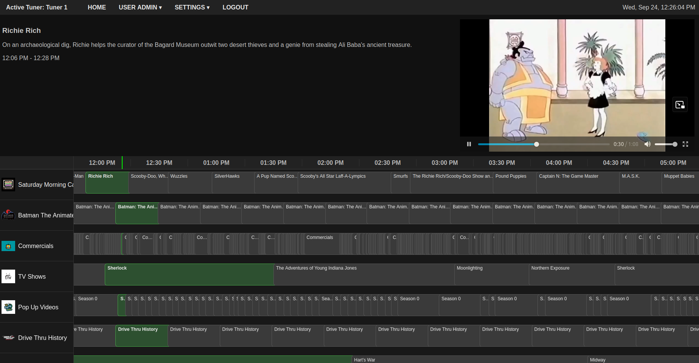
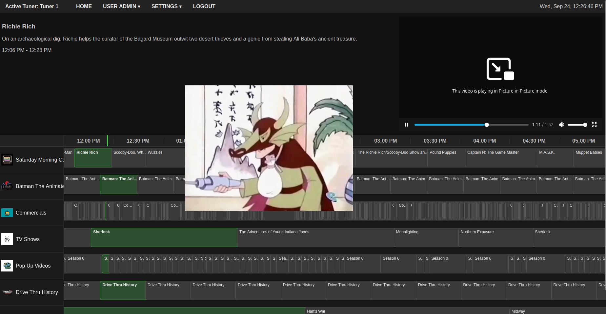
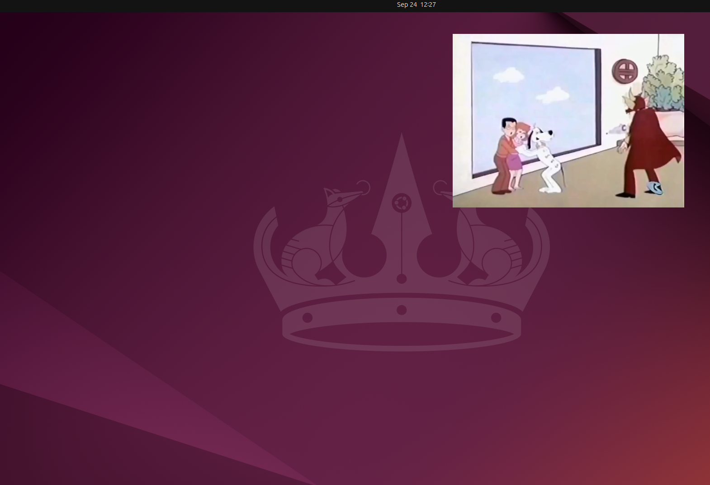
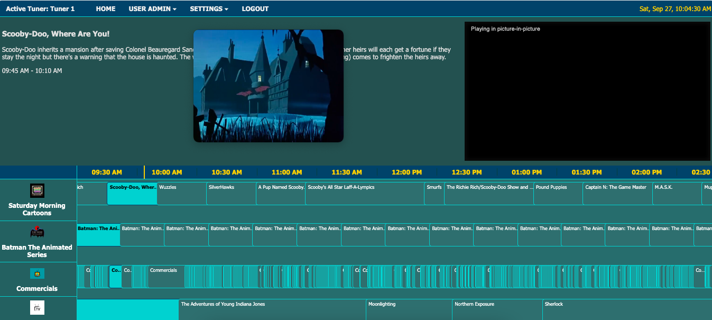

# 📺 RetroIPTVGuide v4.0.0

<p align="center">
  <a href="https://github.com/thehack904/RetroIPTVGuide">
    
  </a>
  <a href="https://github.com/thehack904/RetroIPTVGuide/pkgs/container/retroiptvguide">
    
  </a>
  <a href="https://github.com/thehack904/RetroIPTVGuide/actions/workflows/docker-publish.yml">
    
  </a>
  <a href="https://creativecommons.org/licenses/by-nc-sa/4.0/">
    
  </a>
</p>

Welcome to **RetroIPTVGuide**, a lightweight self-hosted IPTV + EPG web interface inspired by classic cable TV guides — built for modern home labs, retro media setups, and Android/Fire/Google TV screens.
RetroIPTVGuide is an IPTV Web Interface inspired by 90s/2000s cable TV guides.  
It is designed to work with [ErsatzTV](https://ersatztv.org/) [(GitRepo)](https://github.com/ErsatzTV/ErsatzTV/tree/main) but supports any `.m3u`, `.m3u8`, and `.xml` IPTV source.  
Includes **Docker and TrueNAS SCALE deployment** for easy installation and persistence.
----

## 🚀 Features
- 🧰 Unified installers for Linux, Raspberry Pi, and Windows
- 🖥️ Android / Fire / Google TV optimized mode with animated CRT-style glow header
- 🧭 Integrated channel guide (EPG) viewer
- 👥 User management web interface (`manage_users.html`)
- ⚙️ Lightweight Flask backend, easy to self-host
- 🔐 Local-only by default — no external dependencies

## 📦 Image Information

| Registry | Image | Architectures | Updated |
|-----------|--------|----------------|----------|
| **GitHub Container Registry** | `ghcr.io/thehack904/retroiptvguide:latest` | amd64 / arm64 | Automatically via CI/CD |

----
⚠️ **Note:** This is still a BETA release. It is not recommended for direct Internet/public-facing deployments.

- [Installation / Uninstall Guide](INSTALL.md)
- [Changelog](CHANGELOG.md)
- [Roadmap](ROADMAP.md)
- [License](LICENSE)

----


## 🛠 Installation

### 🐳 Docker
```bash
docker pull ghcr.io/thehack904/retroiptvguide:latest
docker run -d -p 5000:5000 ghcr.io/thehack904/retroiptvguide:latest
```

### 🧩 TrueNAS SCALE App
- Upload the provided `retroiptvguide-3.2.0.zip` chart.
- Repository: `ghcr.io/thehack904/retroiptvguide`
- Tag: `latest`
- Exposes port `5000`.

### 🐧 Linux 
```bash
curl -sSL https://raw.githubusercontent.com/thehack904/RetroIPTVGuide/main/retroiptv_linux.sh | sudo bash -s install --agree --yes
```

### 🍓 Raspberry Pi
```bash
curl -sSL https://raw.githubusercontent.com/thehack904/RetroIPTVGuide/main/retroiptv_rpi.sh | sudo bash -s install --agree --yes
```
### 🪟 Windows (PowerShell)
```powershell
Set-ExecutionPolicy Bypass -Scope Process -Force
Invoke-WebRequest https://raw.githubusercontent.com/thehack904/RetroIPTVGuide/main/retroiptv_windows.ps1 -OutFile retroiptv_windows.ps1
.\retroiptv_windows.ps1 install
```

## 🌐 Access
After installation:
```
🌐 RetroIPTVGuide Web Interface: http://<server-ip>:5000
🔑 Default Login: admin / strongpassword123
```

> ⚠️ **Beta Notice:**  
> This version is feature-complete and stable, but still displays a *Beta* disclaimer during installation for liability protection.  
> Do not expose your instance directly to the public Internet.

---

### 🔄 Updating

### 🐧 Linux 
```bash
sudo retroiptv_linux.sh update --yes
```

### 🍓 Raspberry Pi 
```bash
sudo retroiptv_rpi.sh update --yes
```

### 🪟 Windows
**Currently on track for v.4.0.1 release**

---

## 📘 Uninstall

### 🐧 Linux 
```bash
sudo retroiptv_linux.sh uninstall --yes
```

### 🍓 Raspberry Pi
```bash
sudo retroiptv_rpi.sh uninstall --yes
```

### 🪟 Windows
1. Double click or Right Click on retroiptv_windows.bat and select Run As Administrator
2. Select Uninstall

---

## 📸 Screenshots

### 📺 Guide Page


### 📺 Video Pop Out


### 💻 Desktop Pop Out


### 📰 TV Guide Magazine Theme


### 💾 AOL / CompuServe Theme


---
## 🤝 Contributing

Contributions are welcome! Here’s how you can help:

1. **Report Issues** – Found a bug or want to suggest a feature? Open an [issue](../../issues).  
2. **Submit Pull Requests** – Fork, modify, test, and submit PRs for new features or fixes.  
3. **Improve Documentation** – Add screenshots, examples, or clearer explanations.

All contributions will be reviewed before merging into the main branch.

---

## 🧭 Project Info
- **Homepage:** [GitHub – RetroIPTVGuide](https://github.com/thehack904/RetroIPTVGuide)
- **License:** CC BY-NC-SA 4.0
- **Maintainer:** @thehack904

See [ROADMAP.md](ROADMAP.md) for full details.
---

## 💡 Tip
Combine this with **ErsatzTV** for full media channel playout and a seamless retro-TV experience!
