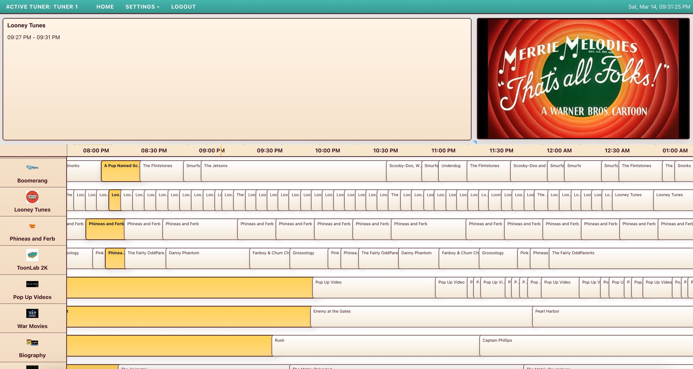

# 📺 RetroIPTVGuide

<p align="center">
  <a href="https://github.com/thehack904/RetroIPTVGuide">
    
  </a>
  <a href="https://github.com/thehack904/RetroIPTVGuide/pkgs/container/retroiptvguide">
    
  </a>
  <a href="https://github.com/thehack904/RetroIPTVGuide/actions/workflows/docker-publish.yml">
    
  </a>
  <a href="https://creativecommons.org/licenses/by-nc-sa/4.0/">
    
  </a>
</p>
<p align="center">
  
</p>

RetroIPTVGuide is a **self‑hosted IPTV guide interface** inspired by
classic cable television listings from the 1990s and early 2000s.

It aggregates **IPTV playlists and XMLTV program data** and presents
them in a **retro‑style channel guide** designed for home lab and 
local network deployments, including use on smart TV browsers.

The project works particularly well alongside playout systems such as
**ErsatzTV**, but supports any IPTV backend that provides:

-   `.m3u` / `.m3u8` playlists\
-   XMLTV `.xml` EPG data\
-   **HLS segmented streams** for browser playback

------------------------------------------------------------------------

## 🚀 Features

• Classic **TV‑style grid guide** for IPTV playlists\
• **Virtual channels** (News, Weather, Traffic, System Status)\
• **Multiple IPTV sources** combined into a single guide\
• **Auto‑scroll channel navigation**\
• **Retro UI themes** inspired by classic TV guides\
• **TV‑optimized interface** for Android TV / Fire TV / browsers\
• **User management** and admin tools\
• **Local‑first architecture** with no cloud dependencies

------------------------------------------------------------------------

## 📦 Releases

Official builds are published through **GitHub Releases**.

RetroIPTVGuide follows semantic versioning for official releases.

https://github.com/thehack904/RetroIPTVGuide/releases

Docker images are automatically built through GitHub Actions.

------------------------------------------------------------------------

## ⚠️ Security & Exposure Notice

RetroIPTVGuide is designed for use within trusted networks. Exposing this
application directly to the public internet may introduce security risks
depending on your environment and configuration.

### You are responsible for:
- Network exposure decisions (port forwarding, reverse proxies, VPN access)
- Authentication and access controls
- Keeping your deployment updated

### Intended Deployment Model
- Home lab / private network use
- Not intended for direct public exposure without additional hardening

### Recommended Access Methods
- VPN (WireGuard / Tailscale)
- Reverse proxy with authentication
- Restricted LAN access

This project is provided "as-is" without warranties of any kind.
Use in publicly accessible environments at your own risk.  RetroIPTVGuide does 
not implement network-level protections or exposure controls.

------------------------------------------------------------------------

## 🐳 Quick Start (Docker)
```
docker pull ghcr.io/thehack904/retroiptvguide:latest 
docker run -d -p 5000:5000 ghcr.io/thehack904/retroiptvguide:latest
```

Then open:

http://`<server-ip>`{=html}:5000

Default login (first-run setup):
admin / strongpassword123

You will be required to change this password immediately on first login.

------------------------------------------------------------------------

## 🔐 Admin Password Reset

If you lose access to the admin account, see: INSTALL.md → Admin Password Recovery

------------------------------------------------------------------------

## 📚 Documentation

Detailed guides are available in the repository:

-   INSTALL.md -- Installation and update instructions
-   ARCHITECTURE.md -- System architecture
-   DATA_FLOW.md -- How playlists and EPG data are processed
-   PROJECT_STRUCTURE.md -- Repository layout
-   SECURITY_MODEL.md -- Security design
-   CHANGELOG.md -- Release history
-   ROADMAP.md -- Planned features

------------------------------------------------------------------------

## IPTV Compatibility

RetroIPTVGuide requires **HLS segmented streams** for browser playback.

Many IPTV servers output **MPEG‑TS streams**, which are not directly
playable in browsers.

For best compatibility, use an IPTV backend that provides **HLS
output**, such as **ErsatzTV**.

------------------------------------------------------------------------

## What This Project Does NOT Do
- Does not secure your network or manage firewall exposure
- Does not replace proper authentication or network isolation
- Does not guarantee safe operation when exposed to the public internet

------------------------------------------------------------------------

## 📡 Content Disclaimer

RetroIPTVGuide is an interface only.

All content displayed within the application is supplied by the user,
and the project has no control over those sources.

Users are responsible for ensuring their usage complies with applicable
laws and terms of service.

This project does not provide, host, or distribute any IPTV streams,
playlists, or media content.

------------------------------------------------------------------------

## 🤝 Contributing

Contributions are welcome.

1.  Open an issue describing the change
2.  Fork the repository
3.  Submit a pull request

------------------------------------------------------------------------

## Project Information

Repository: https://github.com/thehack904/RetroIPTVGuide\
License: CC BY‑NC‑SA 4.0\
Maintainer: @thehack904
